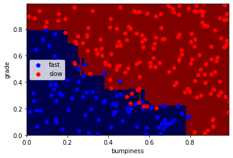
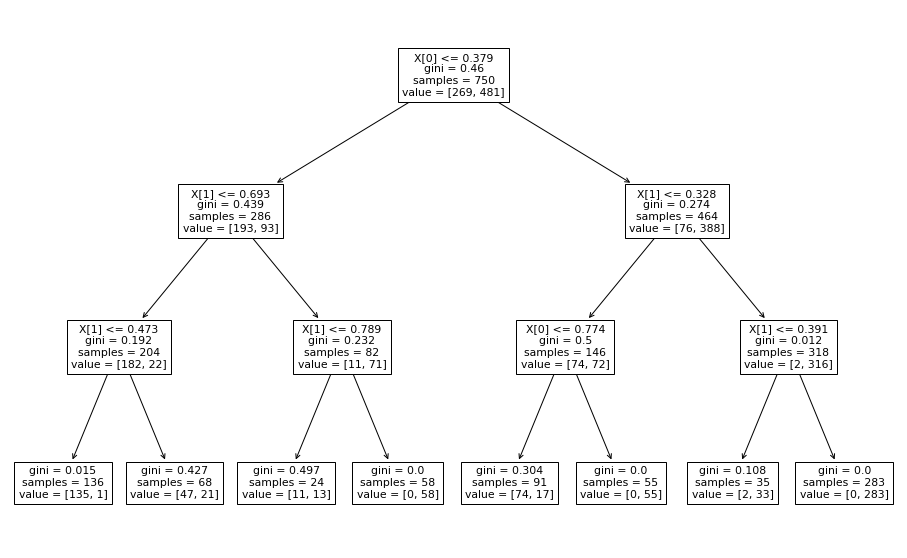
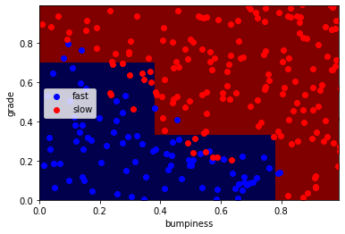
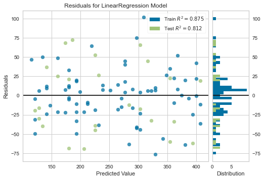
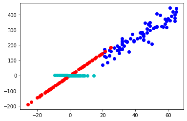
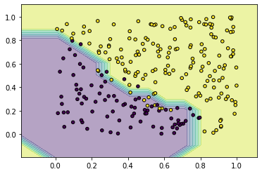

## Overview


## Explanation

Adaboost is often used together with DecisionTree

Adaboost combines a lot of weak learners to make classification

### stump

A tree node with two leaves

### weights

each weight are initialized to be equal, i.e. $\frac{1}{n}$

### total error (of a stump)

the sum of weights of all incorrectly classified samples

### amount of say

given by $\frac{1}{2}\log{\frac{1-TE}{TE}}$

the value can be negative for bad stumps, which will vote in the exact opposite direction

a graphical plot of **amount of say** against the **total error** looks like a verticalized **sigmoid** function

### smoothing

done to prevent `total error` to be exact 1 or 0

### resampling

whenever a sample is classified incorrect, more weight is given to it

`equation incorrect` $\text{new sample weight} = \text{sample weight} * e^{\text{amount of say}}$

`equation correct` $\text{new sample weight} = \text{sample weight} * e^{-\text{amount of say}}$

we then draws a random collection of samples based on the new weights **with replacement**

### Adaboost

In a **forest of stumps** made with **Adaboost**, some stumps gets more weight / are more important than others

The order in which the stumps are made is important, unlike what happens in **Random Forest**

## Data


```python
import pickle
train_X, train_y, test_X, test_y = pickle.load(open('terrain_data.pkl', 'rb'))
```

## Starter Code


```python
from sklearn.ensemble import AdaBoostClassifier

X, y = train_X, train_y

clf = AdaBoostClassifier(n_estimators=100, random_state=0)
clf.fit(X, y)

clf.score(X, y) # train accuracy
```


    0.992


```python
from sklearn.metrics import accuracy_score
pred_y = clf.predict(test_X)
accuracy_score(test_y, pred_y)
```


    0.924


```python
from class_viz import prettyPicture
```


```python
prettyPicture(clf, test_X, test_y)
```

    C:\Users\ng572\Desktop\scikit-learn-quickstart\class_viz.py:20: MatplotlibDeprecationWarning: shading='flat' when X and Y have the same dimensions as C is deprecated since 3.3.  Either specify the corners of the quadrilaterals with X and Y, or pass shading='auto', 'nearest' or 'gouraud', or set rcParams['pcolor.shading'].  This will become an error two minor releases later.
      plt.pcolormesh(xx, yy, Z, cmap=pl.cm.seismic)
    


    

    

```python
from sklearn.tree import DecisionTreeClassifier
```

## Data


```python
import pickle
train_X, train_y, test_X, test_y = pickle.load(open('terrain_data.pkl', 'rb'))
```

## Starter Code


```python
from sklearn import tree
X = [[0, 0], [1, 1]]
Y = [0, 1]
clf = tree.DecisionTreeClassifier()
clf = clf.fit(X, Y)
```

## Hyperparameters

### criterion

gini: 

entropy: minimizes the impurity / maximizes the information after splitting


```python
X = train_X
y = train_y

clf = tree.DecisionTreeClassifier(max_depth=3)
clf = clf.fit(X, y)
```


```python
from sklearn.metrics import accuracy_score
pred_y = clf.predict(test_X)
accuracy_score(test_y, pred_y)
```


    0.908


## Visualization

tree.plot_tree()\
prettyPicture(), which is self-defined


```python
import matplotlib.pyplot as plt
plt.figure(figsize=[16, 10]) # default [6.4, 4.8]
tree.plot_tree(clf)

pass # prevent text print
```


    

    


```python
from class_viz import prettyPicture
```


```python
prettyPicture(clf, test_X, test_y)
```

    <ipython-input-6-fe3a0c9e9aa2>:19: MatplotlibDeprecationWarning: shading='flat' when X and Y have the same dimensions as C is deprecated since 3.3.  Either specify the corners of the quadrilaterals with X and Y, or pass shading='auto', 'nearest' or 'gouraud', or set rcParams['pcolor.shading'].  This will become an error two minor releases later.
      plt.pcolormesh(xx, yy, Z, cmap=pl.cm.seismic)
    


    

    

## Guide

https://scikit-learn.org/stable/modules/feature_selection.html#univariate-feature-selection

### SelectKBest

removes features based on collinearity

### SelectPercentile

removes noises, useful in e.g. NLP


```python

```

## Regularization


```python
from sklearn import linear_model
clf = linear_model.Lasso(alpha=0.1)
clf.fit([[0,0], [1, 1], [2, 2]], [0, 1, 2])

print(clf.coef_)
print(clf.intercept_)
```

    [0.85 0.  ]
    0.15000000000000002
    


```python

```
## Overview

Generally, SVM and K-means clustering are affected by scaling

because the aggregate of 2 dimensions faces trade offs in fitting

## Starter Code


```python
from sklearn.preprocessing import MinMaxScaler
data = [[-1, 2], [-0.5, 6], [0, 10], [1, 18]]
scaler = MinMaxScaler()
print(scaler.fit(data))

#print(scaler.data_max_)

print(scaler.transform(data))

#print(scaler.transform([[2, 2]]))

```

    MinMaxScaler()
    [[0.   0.  ]
     [0.25 0.25]
     [0.5  0.5 ]
     [1.   1.  ]]
    


```python

```
## Overview

there may not be a unique equilibrium for the cluster\
if the data does not contain a lot of signal\
that is, only a local minimum has been reached


## Hyperparameters

### n_clusters

how many clusters

### max_iter

how many iterations, default=300 is usually more than enough

### n_init

how many times will the alog be run, default=10. ensemble gives the final answer


```python
from sklearn.cluster import KMeans
import numpy as np
X = np.array([[1, 2], [1, 4], [1, 0],
              [10, 2], [10, 4], [10, 0]])
kmeans = KMeans(n_clusters=2, random_state=0).fit(X)
kmeans.labels_
```


    array([1, 1, 1, 0, 0, 0])


```python
kmeans.predict([[0, 0], [12, 3]])
```


    array([1, 0])


```python
kmeans.cluster_centers_
```


    array([[10.,  2.],
           [ 1.,  2.]])


## Starter Code


```python
X = [[0], [1], [2], [3]]
y = [0, 0, 1, 1]
from sklearn.neighbors import KNeighborsClassifier
neigh = KNeighborsClassifier(n_neighbors=3)
neigh.fit(X, y)

print(neigh.predict([[1.1]]))

print(neigh.predict_proba([[0.9]]))
```

    [0]
    [[0.66666667 0.33333333]]
    

## Data


```python
import pickle
train_X, train_y, test_X, test_y = pickle.load(open('terrain_data.pkl', 'rb'))
```

## Hyperparameters

### n_neighbors

how many neighbors to consider


```python
X, y = train_X, train_y

neigh = KNeighborsClassifier(n_neighbors=3)
neigh.fit(X, y)
```


    KNeighborsClassifier(n_neighbors=3)


```python
from sklearn.metrics import accuracy_score
pred_y = neigh.predict(test_X)
accuracy_score(test_y, pred_y)
```


    0.936


## Visualization

prettyPicture()


```python
from class_viz import prettyPicture
```


```python
prettyPicture(neigh, test_X, test_y)
```

    C:\Users\ng572\Desktop\scikit-learn-quickstart\class_viz.py:20: MatplotlibDeprecationWarning: shading='flat' when X and Y have the same dimensions as C is deprecated since 3.3.  Either specify the corners of the quadrilaterals with X and Y, or pass shading='auto', 'nearest' or 'gouraud', or set rcParams['pcolor.shading'].  This will become an error two minor releases later.
      plt.pcolormesh(xx, yy, Z, cmap=pl.cm.seismic)
    


    

    

## Starter Code


```python
import numpy as np
from sklearn.linear_model import LinearRegression
X = np.array([[1, 1], [1, 2], [2, 2], [2, 3]])
# y = 1 * x_0 + 2 * x_1 + 3
y = np.dot(X, np.array([1, 2])) + 3
reg = LinearRegression().fit(X, y)
reg.score(X, y)

reg.coef_

reg.intercept_

reg.predict(np.array([[3, 5]]))
```


    array([16.])


## Data

age and net worth relationship


```python
import pickle

train_X, train_y, test_X, test_y = pickle.load(open('networth_data.pkl', 'rb'))
train_X, train_y = np.array(train_X), np.array(train_y)
```


```python
reg = LinearRegression().fit(train_X, train_y)
# test R-squared
print(f'R-square: {reg.score(test_X, test_y)}')
```

    R-square: 0.8123657292322277
    


```python
from sklearn.metrics import mean_squared_error, mean_absolute_error
pred_y = reg.predict(test_X)
print(f'MSE: {mean_squared_error(test_y, pred_y)}')
print(f'Mean Absolute Error: {mean_absolute_error(test_y, pred_y)}')
```

    MSE: 1971.365489138915
    Mean Absolute Error: 40.007805002021065
    

## Visualization

In order to make a **residual plot**, we'll need yellowbrick

It will also give us a good sense of the **heteroscedasticity** in the residuals


```python
from yellowbrick.regressor import ResidualsPlot

visualizer = ResidualsPlot(reg)
visualizer.fit(train_X, train_y) # this line is negligible because we have already fit the train data
visualizer.score(test_X, test_y)
visualizer.show()
```


    

    


    <AxesSubplot:title={'center':'Residuals for LinearRegression Model'}, xlabel='Predicted Value', ylabel='Residuals'>


## Result

The residual plot does look like a normal distribution with std = 40

Which is what we expected given Mean Absolute Error = 40

## Extra Remarks

https://www.youtube.com/watch?v=U46D7oEijlI


```python

```
## Starter Code


```python
import numpy as np
from sklearn.decomposition import PCA
X = np.array([[-1, -1], [-2, -1], [-3, -2], [1, 1], [2, 1], [3, 2]])
pca = PCA(n_components=2)
pca.fit(X)

print(pca.explained_variance_ratio_) # eigen values

print(pca.singular_values_)

```

    [0.99244289 0.00755711]
    [6.30061232 0.54980396]
    

## Data

networth and age


```python
import pickle
train_X, train_y, test_X, test_y = pickle.load(open('networth_data.pkl', 'rb'))
```


```python
import numpy as np
from sklearn.decomposition import PCA
X = np.c_[train_X, train_y]
pca = PCA(n_components=2)
pca.fit(X)

print(pca.explained_variance_ratio_) # eigen values

print(pca.singular_values_)

```

    [0.99748226 0.00251774]
    [806.18694712  40.50314021]
    


```python
first_pc, second_pc = pca.components_

print(first_pc)
print(second_pc)
```

    [-0.13422426 -0.99095098]
    [ 0.99095098 -0.13422426]
    


```python
import matplotlib.pyplot as plt
trans_X = pca.transform(X)

for ii, jj in zip(trans_X, X):
    plt.scatter(first_pc[0] * ii[0], first_pc[1] * ii[0], color='r')
    plt.scatter(second_pc[0] * ii[1], second_pc[1] * ii[1], color='c')
    plt.scatter(jj[0], jj[1], color='b')
```


    

    

## Overview

The SVM algorithm has a complexity of $O(n^3)$, and therefore is not efficient for a large dataset.

It also doesn't work well with lots and lots of noise, when classes are overlapping

## Intro

`margin` the distance to the nearest point

Support Vector Machine seeks to maximize the margin

Some outliers will be ignored


```python
# demo code from the doc
# clf for classifier

from sklearn import svm
X = [[0, 0], [1, 1]]
y = [0, 1]
clf = svm.SVC()
clf.fit(X, y)
```


    SVC()


## Data

we'll be using terrain features and decide whether we should go slow or fast

## Model Hyperparameters

### $\gamma$
defines how far the influence of a single data point reaches

high values like 1000 gives non-linear results while small values like 1.0 gives linear results

### C

high values gives non-linear results while small values gives linear results

usual suspects include $10^1, 10^2, 10^3, 10^4$


```python
import pickle
train_X, train_y, test_X, test_y = pickle.load(open("terrain_data.pkl", "rb"))
```


```python
clf = svm.SVC(kernel='rbf', gamma=10) # linear / poly / rbf / sigmoid
clf.fit(train_X, train_y)
```


    SVC(gamma=10)


```python
pred_y = clf.predict(test_X)
```


```python
from sklearn.metrics import accuracy_score

accuracy_score(y_true = test_y, y_pred=pred_y, normalize=True)
```


    0.932


## Visualization

np.meshgrid\
np.arange(x_min, x_max, 0.1)\
plt.contour\
plt.scatter


```python
import numpy as np
import matplotlib.pyplot as plt

X, y = np.array(test_X), np.array(test_y)

# Plotting decision regions
x_min, x_max = X[:, 0].min(), X[:, 0].max()
y_min, y_max = X[:, 1].min(), X[:, 1].max()

x_range, y_range = x_max - x_min, y_max - y_min
x_min, x_max = x_min - x_range*0.2, x_max + x_range*0.2
y_min, y_max = y_min - y_range*0.2, y_max + y_range*0.2

xx, yy = np.meshgrid(np.arange(x_min, x_max, 0.1),
                     np.arange(y_min, y_max, 0.1))

# fig, axarr = plt.subplots(2, 2, sharex='col', sharey='row', figsize=(10, 8))
# axarr.contourf()
# axarr.scatter()

Z = clf.predict(np.c_[xx.ravel(), yy.ravel()])
Z = Z.reshape(xx.shape)

plt.contourf(xx, yy, Z, alpha=0.4)
plt.scatter(X[:, 0], X[:, 1], c=y, s=20, edgecolor='k')
plt.show()
```


    

    


## Result

the SVM performed better than Naive Bayes

## Features Transformation

aside from (x, y), we can input $z = x^2 + y^2$ to the SVM
